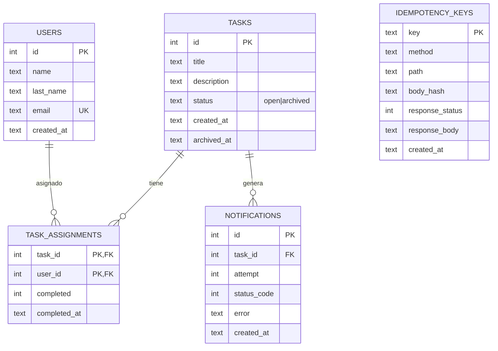

# Reto Geest — API REST de gestión de tareas

API REST en **Node.js + TypeScript + Express + SQLite (better-sqlite3)** que implementa los endpoints del reto con idempotencia, archivado atómico y notificaciones con reintentos.

## Stack y decisiones técnicas

- **Node.js 20+ / TypeScript** — tipado estático y buena ergonomía.
- **Express** — simple, estable, ecosistema maduro para tests con `supertest`.
- **SQLite + better-sqlite3** — base de datos SQL real, con transacciones ACID y API **síncrona**, lo que facilita razonar sobre concurrencia en un solo proceso. Fácil de desplegar como archivo persistente.
- **Zod** — validación declarativa de bodies con mensajes útiles.
- **Vitest + supertest** — tests unitarios/integración rápidos.
- **Migraciones versionadas** — `db/migrations/*.sql` aplicadas idempotentemente al arranque.

### Cómo se resuelven los requisitos de confiabilidad

1. **Idempotencia (POST)** — Middleware `idempotencyMiddleware` que:
   - Lee `Idempotency-Key`. Si no está, ejecuta normal.
   - Calcula hash del body. Si la misma key llega con otro body → `409 IDEMPOTENCY_CONFLICT`.
   - Guarda la respuesta completa en `idempotency_keys`. Replays devuelven la respuesta cacheada.
   - **Paralelismo**: se usa un `Map` de promesas en memoria + `INSERT` atómico en la tabla. Dos requests concurrentes con la misma key esperan la misma promesa y obtienen el mismo resultado. La fila persiste por si el proceso se reinicia.
2. **Archivado sin duplicados** — Al completar la parte de un usuario se ejecuta `db.transaction(...)` que:
   - Cuenta asignaciones pendientes.
   - Solo hace `UPDATE tasks SET status='archived' ... WHERE id=? AND status='open'`.
   - Si `changes === 1`, ESE request ganó la carrera y dispara la notificación. El otro request obtiene `changes === 0`. Garantiza archivar **y notificar exactamente una vez**, incluso con clics simultáneos.
3. **Notificaciones con reintentos** — `dispatchNotification` hace `POST` a `NOTIFY_URL` con backoff exponencial (0s, 1s, 2s), máx. 3 intentos. Registra cada intento (`attempt`, `status_code`, `error`, `created_at`) en la tabla `notifications`, consultable vía `GET /tasks/:idTask/notifications`. Se reintenta ante 5xx/errores de red; no ante 4xx.

## Ejecutar localmente

Requisitos: Node.js ≥ 20 y `pnpm` ≥ 9.

```bash
pnpm install
cp .env.example .env             # opcional
pnpm migrate                     # aplica migraciones SQL (idempotente)
pnpm dev                         # arranca en http://localhost:3000
```

Build de producción:

```bash
pnpm build
pnpm start
```

## Ejecutar los tests

```bash
pnpm test
```

## Variables de entorno

| Var                    | Descripción                             | Default               |
| ---------------------- | --------------------------------------- | --------------------- |
| `PORT`                 | Puerto HTTP                             | `3000`                |
| `DB_FILE`              | Ruta al archivo SQLite                  | `./data.sqlite`       |
| `NOTIFY_URL`           | URL externa a notificar al archivar     | (vacío → no notifica) |
| `NOTIFY_RETRY_BASE_MS` | Base del backoff (tests suelen bajarlo) | `1000`                |

## Endpoints

| Método | Ruta                           | Descripción                                             |
| ------ | ------------------------------ | ------------------------------------------------------- |
| POST   | `/users`                       | Crea usuario                                            |
| GET    | `/users`                       | Lista usuarios + tareas pendientes                      |
| GET    | `/users/:idUser/tasks`         | Tareas del usuario                                      |
| POST   | `/tasks`                       | Crea tarea (`status: open`)                             |
| POST   | `/tasks/:idTask/assign`        | Asigna `userIds[]`                                      |
| POST   | `/tasks/:idTask/complete`      | Marca la parte del usuario. Archiva si todos terminaron |
| GET    | `/tasks?status=open\|archived` | Lista tareas                                            |
| GET    | `/tasks/:idTask`               | Detalle con usuarios y completado                       |
| GET    | `/tasks/:idTask/notifications` | Intentos de notificación                                |

Errores: `{ "error": { "code": "...", "message": "..." } }`.

## UML de la base de datos



## Supuestos ante ambigüedades

- `status` sólo admite `open|archived`.
- Los `POST` sin `Idempotency-Key` se ejecutan siempre (no son idempotentes por sí mismos); la idempotencia es opt-in vía header.
- Sólo se cachean respuestas exitosas. Un error no bloquea reintentos con la misma key.
- Un usuario se puede asignar a una tarea sólo una vez (PK compuesta). Reasignar es no-op exitoso.
- No se permite asignar a tareas `archived`.
- Completar la parte de un usuario ya completado es no-op.
- El email es único por usuario.
- `NOTIFY_URL` puede estar vacía; en ese caso no se notifica y sólo se registra que no se intentó.
- No hay autenticación (fuera del alcance del reto).

## Funcionalidad recortada

- Sin autenticación / autorización.
- Sin paginación en listados.
- Sin worker de notificaciones en background: los reintentos corren en el mismo proceso con `setTimeout`. En producción real convendría una cola (BullMQ, SQS) o un cron que recupere pendientes del estado persistido.

## Mejora extra — **Borrado lógico de tareas con cascade**

- **Qué problema resuelve**: no había forma de eliminar tareas mal creadas sin perder historial. `DELETE /tasks/:idTask` marca la tarea como `cancelled` (soft delete), la excluye de listados, y registra `cancelled_at`. Se preservan asignaciones y notificaciones para auditoría.
- **Por qué era necesaria**: los sistemas de gestión de trabajo reales necesitan poder cancelar tareas; el archivado sólo aplica al flujo feliz.
- **Por qué esta y no otras**: es un cambio de alto valor y bajo costo, no toca los flujos existentes (no rompe la máquina de estados `open → archived`), y demuestra diseño de estados. Alternativas como autenticación o import { a as ClassValue, c as EngineOptions, d as ValidatorImpls, i as ClassNameValue, n as ClassDictionary, o as CnFunction, r as ClassNameArray, s as Engine, t as ClassArray, u as Tables } from "./types2.js";
  import { a as ConfigExtension, n as CnConfig, o as CreateCnInput } from "./compiler2.js";
  import { clsx, createEngine, twJoin } from "./engine.js";

//#region src/index.d.ts
/**

- Merge Tailwind CSS classes with clsx-style arguments (strings, arrays,
- objects, conditionals). Drop-in replacement for `twMerge(clsx(...))`.
  _/
  declare const cn: CnFunction;
  /_*tailwind-merge–compatible variadic merge (strings + nested arrays).*/
  declare const twMerge: (...inputs: ClassNameValue[]) => string;
  //#endregion
  export { type ClassArray, type ClassDictionary, type ClassNameArray, type ClassNameValue, type ClassValue, type CnConfig, type CnFunction, type ConfigExtension, type CreateCnInput, type Engine, type EngineOptions, type Tables, type ValidatorImpls, clsx, cn, createEngine, twJoin, twMerge };paginación eran más invasivas o menos útiles para el MVP evaluado.

## Deploy

La API se puede desplegar en cualquier proveedor que permita Node y un volumen persistente para SQLite (Fly.io, Railway, Render con disco, o VPS).

- **Proveedor recomendado**: **Fly.io** con un volume montado en `/data` (`DB_FILE=/data/data.sqlite`). Se eligió por simplicidad, capa gratuita y soporte nativo de volúmenes persistentes — SQLite necesita disco persistente, lo cual no está garantizado en plataformas puramente serverless.
- **Cómo acceder**: una vez desplegada, la API queda disponible en la URL pública asignada por el proveedor (por ejemplo `https://reto-geest.fly.dev`). Se puede verificar con `curl https://<host>/tasks`.

Pasos (Fly.io):

```bash
fly launch --no-deploy
fly volumes create data --size 1
# en fly.toml: [[mounts]] source="data" destination="/data"
fly secrets set NOTIFY_URL=https://...
fly deploy
```
